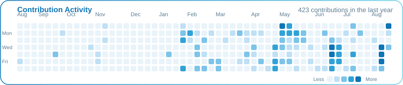

<div align="center">

<!-- Dynamic Header Banner -->


<!-- Typing Animation -->
<a href="https://github.com/bek023">
  
</a>

<p align="center">
  
  
  
</p>

</div>

---

### ⚡ About Me

```yaml
developer: Mansur Tuyg'unov
location: Samarkand, Uzbekistan 🇺🇿
focus_areas: [Mobile Development, Modern Web, Scalable UI]
currently_building: ConnectHub (Real-time Flutter chat)
core_stack: [Flutter, Dart, Angular, React, TypeScript]
motto: "Clean architecture, seamless user experiences."
```

- 🔭 Currently building **[ConnectHub](https://github.com/Bek023/ConnectHub)** — a real-time chat app built with Flutter
- 🌱 Deepening my skills in **Flutter** and scalable mobile architecture
- 🎮 Also shipped **[game2048](https://github.com/Bek023/game2048)** — a 2048 game built with Flutter
- 💬 Ask me about **Flutter, Angular, React, TypeScript**
- 📫 Reach me at **tolmasivich.mansur@gmail.com**

<br/>

### 🚀 Featured Projects

<div align="center">

<a href="https://github.com/Bek023/ConnectHub">
  
</a>
<br/>
<a href="https://github.com/Bek023/game2048">
  
</a>

</div>

<br/>

### 🛠️ Tech Stack

<div align="center">


</div>

<br/>

### 📊 GitHub Stats

<div align="center">




</div>

<br/>

### 🌐 Connect with Me

<div align="center">

<a href="mailto:tolmasivich.mansur@gmail.com">
  
</a>
<a href="https://instagram.com/bek_tolmasivich" target="_blank">
  
</a>
<a href="https://www.leetcode.com/bek_tolmasivich" target="_blank">
  
</a>

</div>


